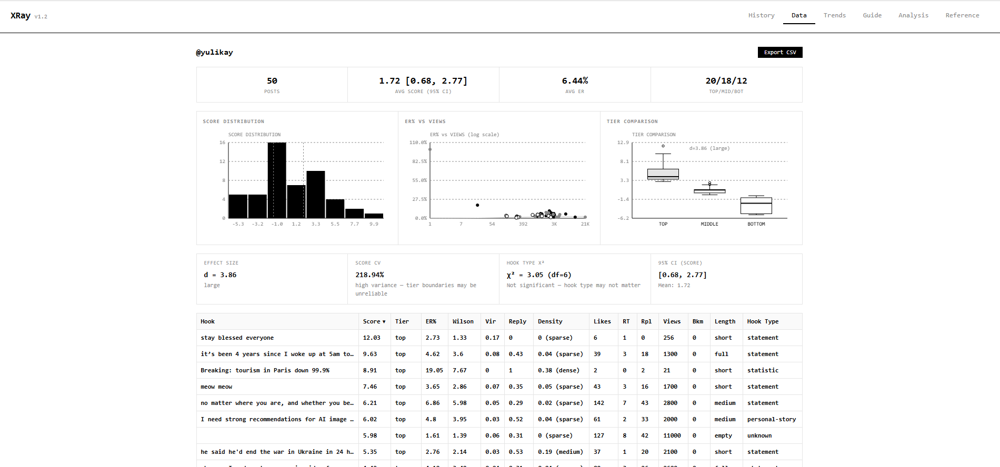
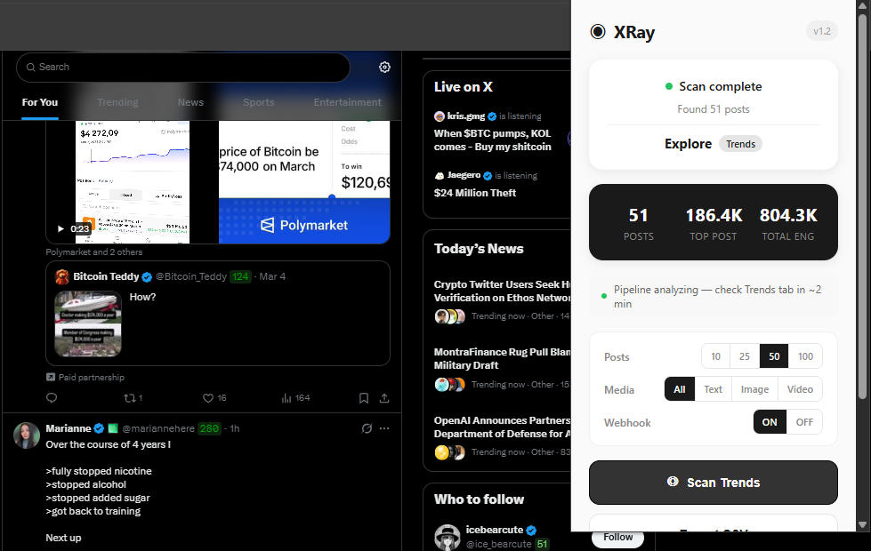
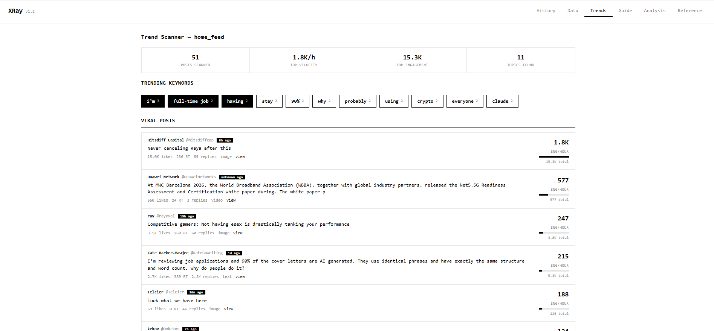

# XRay — Twitter/X Content Analysis Chrome Extension

A Chrome extension that scrapes Twitter/X posts and runs statistical content analysis to find what performs best and why.

Built as a personal tool for data-driven content strategy — not just vanity metrics, but Wilson confidence intervals, z-score normalization, effect sizes, and chi-squared tests on hook types.



## What It Does

**Profile Scan** — Visit any Twitter/X profile, hit Scan, and get:
- Composite scoring (Wilson ER × virality × reply rate, z-normalized across the batch)
- Tier classification (top / middle / bottom) with Cohen's d effect size
- Hook type analysis with chi-squared significance testing
- Info density scoring and length class breakdown
- Interactive charts: score distribution histogram, ER vs Views scatter, tier box plot

**Trend Scanner** — On your Home Feed, hit Scan Trends to find:
- Posts sorted by velocity (engagement/hour) — what's blowing up right now
- N-gram keyword extraction (unigrams + bigrams)
- Topic clustering by shared keywords
- Top authors and trending hooks

**AI Analysis** *(requires n8n backend)* — Sends scraped data to an n8n pipeline that runs LLM analysis (Ollama/llama3) and returns:
- What works / what doesn't work (with evidence)
- Why it works (psychological mechanisms)
- Content templates based on top performers
- Audience profile (wants, pain points, identity)

## Screenshots

| Popup | Dashboard | Trends |
|-------|-----------|--------|
|  |  |  |

## Architecture

```
┌─────────────┐     ┌──────────────┐     ┌─────────────────┐
│  Content     │     │   Popup      │     │   Dashboard     │
│  Script      │────▶│              │────▶│                 │
│  (scraper)   │     │  scan UI     │     │  charts/tables  │
└─────────────┘     └──────┬───────┘     │  stats/guide    │
                           │             │  AI analysis    │
                           ▼             └─────────────────┘
                    ┌──────────────┐
                    │  Background  │
                    │  Service     │──── POST ───▶  n8n webhook
                    │  Worker      │                   │
                    └──────────────┘                   ▼
                                                 ┌──────────┐
                                                 │  Ollama   │
                                                 │  (LLM)   │
                                                 └────┬─────┘
                                                      │
                                                      ▼
                                               Telegram / Obsidian
```

**Frontend** (runs entirely in browser):
- `content/scraper.js` — DOM scraping via Twitter's `data-testid` selectors
- `lib/metrics.js` — Statistical engine (Wilson intervals, z-scores, chi-squared, Cohen's d)
- `lib/trends.js` — Velocity calculation, n-gram extraction, topic clustering
- `lib/charts.js` — Canvas-based chart renderer (histogram, scatter, box plot)

**Backend** (optional, self-hosted):
- n8n workflow handles LLM prompt engineering, Telegram notifications, Obsidian export
- Ollama runs locally for privacy — no data sent to cloud APIs

## Setup

### Extension only (no AI analysis)

```bash
git clone https://github.com/guttank2/xrayv2.git
cd xrayv2
cp config.example.js config.js
# Edit config.js — set your webhook URL (or leave as-is if not using n8n)
```

1. Open `chrome://extensions`
2. Enable **Developer mode** (top right)
3. Click **Load unpacked** → select the `xrayv2` folder
4. Navigate to any Twitter/X profile → click the XRay icon → **Scan Posts**

### With AI analysis (requires n8n + Ollama)

You'll need:
- [n8n](https://n8n.io/) instance (self-hosted or cloud)
- [Ollama](https://ollama.ai/) running locally with `llama3` model
- A webhook endpoint configured in n8n to receive POST requests

Set your webhook URL in `config.js`:

```js
const WEBHOOK_URL = 'https://your-n8n-instance.com/webhook/xray-webhook';
```

## Scoring Formula

Each post gets a **composite score** based on z-score normalized metrics:

```
Score = z(Wilson ER) × 1  +  z(Virality) × 3  +  z(Reply Rate) × 2  +  log₁₀(engagement)  +  save_bonus
```

Where:
- **Wilson ER** — engagement rate with Wilson lower bound (penalizes low-view posts)
- **Virality** — retweets / likes (sharing signal)
- **Reply Rate** — replies / (likes + retweets) (conversation signal)
- **Save bonus** — 2× bookmark rate (high-intent signal)

Z-scores are computed across the entire scan batch, so scores are relative to that account's own content.

## Tech Stack

- Chrome Extension Manifest V3
- Vanilla JavaScript (zero dependencies)
- Canvas API for charts
- n8n for backend orchestration
- Ollama (llama3) for LLM analysis

## License

MIT
